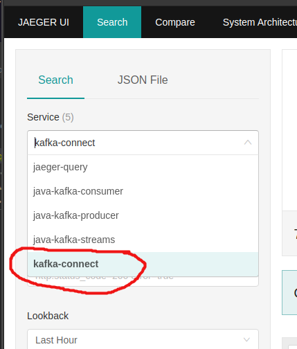

## KafkaConnect Debezium, read from Postgresql

- [KafkaConnect Debezium, read from Postgresql](#kafkaconnect-debezium-read-from-postgresql)
  - [Deploy&prepare Postgresql](#deployprepare-postgresql)
    - [Postgresql deployment](#postgresql-deployment)
    - [Create db and table](#create-db-and-table)
  - [Deploy KafkaConnect](#deploy-kafkaconnect)
  - [Deploy Connector](#deploy-connector)
  - [Verify Postgresql Connector](#verify-postgresql-connector)
  - [Option: Connector without JSON schema generation](#option-connector-without-json-schema-generation)
- [Tracing](#tracing)

### Deploy&prepare Postgresql

First we deploy a Postgresql db, which serves as source for our Connector. We'll only run one Postgresql instance, no HA , since the focus of this setup is on _Tracing_ and not on deploying HA RDBMS on K8s.
Since the Kubernetes cluster is setup in GKE, I will use the storageclass _standard_ which is available by default. Please adjust this if you are running Kubernetes on a different provider or locally on your workstation via microk8s , k3s , etc.

#### Postgresql deployment

Inspect the yaml manifest [here](./kafka-connect/postgresql.yaml)  
and apply it via ```kubectl apply -f kafka-connect/postgresql.yaml```

Afterwards check the status of the Postgresql pod via: ```kubectl get pod -l app=postgres```

#### Create db and table

use the following command to enter a prompt within the Postgresql database. The db user + password are hardcoded (check the spec in [postgresql.yaml](kafka-connect/postgresql.yaml), they need to match.). Of course this is not according security best practices, but good enough for a quick demo. A more secure approach would be to e.g. put the credentials into a Kubernetes secret object.

```bash
kubectl run postgres-postgresql-client --rm --tty -i --restart='Never' --image docker.io/bitnami/postgresql:11.9.0-debian-10-r48 --env="PGPASSWORD=dbpasswd" --command -- psql --host postgres -U dbuser -d postgres -p 5432
```

Then create a database, a table and insert some data:

```
postgres=# CREATE DATABASE inventory;
postgres=# \c inventory;
inventory=# CREATE TABLE products (product_no integer primary key, name text, price numeric);
inventory=# INSERT INTO products VALUES (1, 'Cheese', 9.99);
inventory=# INSERT INTO products VALUES (2, 'Beer', 5.99);
inventory=# INSERT INTO products VALUES (3, 'Salmon', 29.99);

```


### Deploy KafkaConnect

We first need to build a container, which includes the Postgresql Debezium driver, so that we actually can point our KafkaConnect connector to the Postgresql database. This step is **optional**, you can also simply go ahead and apply the yaml manifest (which is referring to the container image within my DockerHub account).

- grab the Postgresql driver archive 
```
curl https://repo1.maven.org/maven2/io/debezium/debezium-connector-postgres/1.5.0.Final/debezium-connector-postgres-1.5.0.Final-plugin.tar.gz | tar xvz
```
- create Dockerfile to build the container
```
cat <<EOF >Dockerfile
FROM docker.io/strimzi/kafka:0.16.1-kafka-2.4.0
USER root:root
RUN mkdir -p /opt/kafka/plugins/debezium
COPY ./debezium-connector-postgres/ /opt/kafka/plugins/debezium/
USER 1001
EOF
```
- build the image and upload it to e.g. DockerHub (you can also use any other container repository, of course).
```
# if not logged in into dockerhub, execute: ```docker login docker.io``` first
export DOCKER_ORG=gkoenig
docker build . -t ${DOCKER_ORG}/connect-debezium
docker push ${DOCKER_ORG}/connect-debezium
```

The KafkaConnect configuration specifies:

- _bootstrapServers_ : the bootstrap Kafka server of the target kafka cluster
- _tracing_ : enables tracing, we specify type to be _jaeger_
- the configuration of the Jaeger components within block _connectContainer_::_env_ 
- format of key+value shall be JSON
- creation of schema for key + payload via properties _[key|value].converter.schemas.enable_
  
Inspect the yaml manifest [here](./kafka-connect/kafka-connect.yaml)  
and apply it via ```kubectl apply -f kafka-connect/kafka-connect.yaml```

### Deploy Connector

The Postgresql connector is configured to 
- run in same namespace as kafka-connect itself, hence point to our _prod_ kafka cluster
- observe db _inventory_ and whitelist the table _public.products_
- use the builtin logical decoder plugin _pgoutput_ , to avoid having to install additional plugin
- create topics automatically, if they are not in place

Inspect the yaml manifest [here](./kafka-connect/postgresql-connector.yaml)  
and apply it via ```kubectl apply -f kafka-connect/postgresql-connector.yaml```

You can verify its status via e.g. KafkaConnect REST Api:

```bash
# establish local port 8083 forward to KafkaConnect 8083
kubectl port-forward service/my-connect-cluster-connect-api 8083:8083 -n kafka-cluster
# get a list of connectors
curl http://localhost:8083/connectors
["inventory-connector"]
# ask for its status
curl http://localhost:8083/connectors/inventory-connector/status
{"name":"inventory-connector","connector":{"state":"RUNNING","worker_id":"10.0.2.63:8083"},"tasks":[{"id":0,"state":"RUNNING","worker_id":"10.0.2.63:8083"}],"type":"source"}
```

### Verify Postgresql Connector

Now that the connector is running, let's check topics in _prod_ Kafka cluster (filter for _products_ , since this is the Postgres table we want to sync):

```bash
kubectl run kafka-producer -ti     --image=strimzi/kafka:0.20.0-rc1-kafka-2.6.0     --rm=true     --restart=Never     -- bin/kafka-topics.sh --bootstrap-server prod-strimzi-cluster-kafka-bootstrap.kafka-cluster:9092 --list | grep 'products'

If you don't see a command prompt, try pressing enter.
inventorydb.public.products
```

**BRILLIANT** !  
The Kafka connector created the topic _inventorydb.public.products_ . Topics will be named after \<databasename>.\<tablespace>.\<tablename>  

Let's start a consumer to see whats inside this topic. The output is a lengthy JSON string, hence let's limit the output to exactly 1 message :  

```bash
kubectl run kafka-consumer -ti \
  --image=strimzi/kafka:latest-kafka-2.4.0 \
  --rm=true --restart=Never \
  -- bin/kafka-console-consumer.sh --bootstrap-server prod-strimzi-cluster-kafka-bootstrap.kafka-cluster:9092 --topic inventorydb.public.products --from-beginning 
```

> Since we configured KafkaConnect with JSON Schema enabled, Connect will enrich each message key&value by its schema. This means, that every message within Kafka  contains also its schema. It is benefitial for consumers, because they can interpret the schema for the messages' data, but on the other hand it generates a lot of overhead to ship the whole schema with each message, hereby bloating the required data space within Kafka.

Reformatted, for better readability, taken the a Kafka message from the output looks like:

```bash
{
   "schema":{...
   },
   "payload":{
      "before":null,
      "after":{
         "product_no":3,
         "name":"Salmon",
         "price":29.99
      },
      "source":{...
      },
      "op":"c",
      "ts_ms":1623248277898,
      "transaction":null
   }
}
```

The JSON is split into 2 parts
- schema => describes the schema of the payload below, means data-types, if a property is optional or not, etc
- payload => the data itself

The actual data from the postgres table within the  _payload_ itself is separated into a **_before_** and a **_after_** block, to be able to discover on consumer side what happened to this dataset. In the above example the _before_ block is empty and the _after_ block contains the data set from the products table, which means this was an INSERT of a new dataset.  
The property **_op_** specifies the operation on db side, and has one of the CRUD values. In the example above we see _c_, which stands for _create_.  

### Option: Connector without JSON schema generation

If you do not want to create JSON encoded schema by the Connector, you can adjust the following properties to only receive the payload within the Kafka messages.  

Set the following properties in _kafka-connect.yaml_ (toggle from _true_ to _false_ ):

```bash
    key.converter.schemas.enable: false
    value.converter.schemas.enable: false
```

Then  
- update Connect: ```kubectl apply -f kafka-connect/kafka-connect.yaml```  
- restart Postgresql Connector: ```kubectl delete -f kafka-conect/postgresql-connector.yaml && sleep 5 && kubectl apply -f kafka-connect/postgresql-connector.yaml```
- open a session to the postgres db and add another dataset:  

    ```bash
    insert into products values (4,'Apples',1.79);
    insert into products values (5,'Lemonade',2.49);
    ```

and check the output of the console consumer:

```bash
{"before":null,"after":{"product_no":4,"name":"Apples","price":1.79},"source":{"version":"1.5.0.Final","connector":"postgresql","name":"inventorydb","ts_ms":1623250402640,"snapshot":"false","db":"inventory","sequence":"[\"23611312\",\"23611312\"]","schema":"public","table":"products","txId":507,"lsn":23626456,"xmin":null},"op":"c","ts_ms":1623250403103,"transaction":null}
{"before":null,"after":{"product_no":5,"name":"Lemonade","price":2.49},"source":{"version":"1.5.0.Final","connector":"postgresql","name":"inventorydb","ts_ms":1623250484878,"snapshot":"false","db":"inventory","sequence":"[\"23627256\",\"23627256\"]","schema":"public","table":"products","txId":508,"lsn":23627312,"xmin":null},"op":"c","ts_ms":1623250485076,"transaction":null}
```

which, reformatted, gives you exactly our two added datasets:

```bash
{
   "before":null,
   "after":{
      "product_no":4,
      "name":"Apples",
      "price":1.79
   },
   "source":{...
   },
   "op":"c",
   "ts_ms":1623250403103,
   "transaction":null
}{
   "before":null,
   "after":{
      "product_no":5,
      "name":"Lemonade",
      "price":2.49
   },
   "source":{...
   },
   "op":"c",
   "ts_ms":1623250485076,
   "transaction":null
}
```

## Tracing

Since we enabled tracing via Jaeger within the Kafka Connect instance, let's have a look at our Jaeger UI and check for a new entry in the list of services:

Activate port forwarding: ```kubectl port-forward service/my-connect-cluster-connect-api 8083:8083 -n kafka-cluster```
Open browser: http://localhost:8083



If you select "kafka-connect" and click on _Find traces_ you will see a trace for each single activity we did above (means for each insertion into the database we have one Kafka message, which results in one Jaeger trace).  
Of course this trace is not very meaningful because we simply have one activity from the Connector on each message, but now it is up to your motivation to plumb more parts into a workflow. E.g adding Kafka streams reading from this topic, converting some data, store it into another topic which will be read by a consumer. Use the tracing output for each of this clients to see a whole dependency tree of each particular message as it flows through your system.......like we did e.g. [in the intro chapter of Jaeger](./Readme.md#first-tracing-in-action)