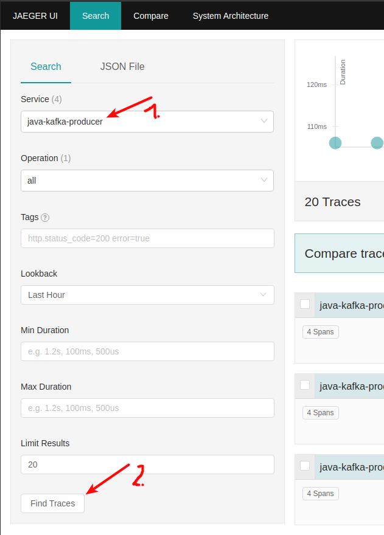
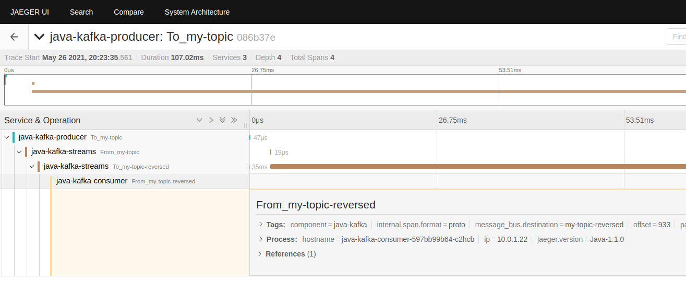

# Strimzi Kafka & Jaeger tracing first steps

Below you'll find instructions to start playing around with a Kafka cluster deployed on Kubernets, by using _Strimzi_ operator.  
On top of that we'll use Jaeger to create&display tracing info. Those tracing information is created with producers, consumers and streams applications.  
As underlying Kubernetes cluster, we'll use GKE, but you can use whichever K8s flavour you prefer.  

I will also show you how to apply **GitOps** approach of bringing applications/configuration to your K8s cluster by using [Flux v2](https://fluxcd.io/) to setup Kafka and Topics. You will find the step-by-step instructions in the section about [deploying Kafka cluster](#deploy-kafka-cluster)

- [Strimzi Kafka & Jaeger tracing first steps](#strimzi-kafka--jaeger-tracing-first-steps)
  - [base GCP setup](#base-gcp-setup)
  - [create GKE cluster](#create-gke-cluster)
  - [deploy Strimzi operator](#deploy-strimzi-operator)
    - [preparations](#preparations)
    - [Set namespace for the operator](#set-namespace-for-the-operator)
    - [Set namespace & additional rolebindings for Kafka cluster](#set-namespace--additional-rolebindings-for-kafka-cluster)
    - [finally deploy the Strimzi operator](#finally-deploy-the-strimzi-operator)
  - [Deploy Kafka cluster](#deploy-kafka-cluster)
  - [Producing/Consuming messages](#producingconsuming-messages)
  - [Jager](#jager)
    - [Deploying Jager core components](#deploying-jager-core-components)
    - [Accessing the Jaeger UI](#accessing-the-jaeger-ui)
  - [First tracing in action](#first-tracing-in-action)
    - [Manual approach, executing _kubectl_](#manual-approach-executing-kubectl)
    - [GitOps approach](#gitops-approach)
  - [Kafka Connect](#kafka-connect)

## base GCP setup

- create new project within GCP console, name: strimzi-and-jaeger-eval
- create new configuration for gcloud cli: ```gcloud config configuration create strimzi-jaeger```
- set project: ```gcloud config set project strimzi-and-jaeger-eval```
- authenticate with your Google account: ```gcloud auth login```

## create GKE cluster

For this playground let's create a single-zone cluster, consisting of 2 nodes. Please adjust the _machine-type_ according to your needs, the "e2-standard-2" ships with 2CPUs and 8GB Ram.

```bash
gcloud container clusters create strimzi-jaeger-eval \
  --num-nodes=2 \
  --zone=europe-central2-a \
  --machine-type=e2-standard-2
```

## deploy Strimzi operator

We'll use plain Strimzi yaml files, to avoid installing Helm additionally.
Alternative would be to install Strimzi operator via Helm.
The operator will be installed into namespace _kafka-op_ and the Kafka cluster itself into namespace _kafka-cluster_.

### preparations

```bash
kubectl create ns kafka-op
kubectl create ns kafka-cluster
kubectl create ns testing
wget https://github.com/strimzi/strimzi-kafka-operator/releases/download/0.22.1/strimzi-0.22.1.tar.gz
tar -xvzf strimzi-0.22.1.tar.gz
cd strimzi-0.22.1
```

### Set namespace for the operator

```bash
sed -i 's/namespace: .*/namespace: kafka-op/' install/cluster-operator/*RoleBinding*.yaml
```

### Set namespace & additional rolebindings for Kafka cluster

Open file 060-Deployment-strimzi-cluster-operator.yaml (under install/cluster-operator folder) and locate the STRIMZI_NAMESPACE environment variable to specify our namespace, as shown below:

```bash
          env:
            - name: STRIMZI_NAMESPACE
              value: kafka-cluster,testing
```

Create rolebindings for our desired namespaces, _kafka-cluster_ and _testing_:

```bash
kubectl apply -f install/cluster-operator/020-RoleBinding-strimzi-cluster-operator.yaml -n kafka-cluster
kubectl apply -f install/cluster-operator/031-RoleBinding-strimzi-cluster-operator-entity-operator-delegation.yaml -n kafka-cluster
kubectl apply -f install/cluster-operator/032-RoleBinding-strimzi-cluster-operator-topic-operator-delegation.yaml -n kafka-cluster

kubectl apply -f install/cluster-operator/020-RoleBinding-strimzi-cluster-operator.yaml -n testing
kubectl apply -f install/cluster-operator/031-RoleBinding-strimzi-cluster-operator-entity-operator-delegation.yaml -n testing
kubectl apply -f install/cluster-operator/032-RoleBinding-strimzi-cluster-operator-topic-operator-delegation.yaml -n testing
```

### finally deploy the Strimzi operator

```bash
kubectl apply -f install/cluster-operator -n kafka-op
kubectl create -f install/cluster-operator/040-Crd-kafka.yaml # because this file is too large for kubectl apply ...
```

...and verify it: ```kubectl get deployments -n kafka-op```  
until you see the deployment up and running, like e.g.:

```bash
NAME                       READY   UP-TO-DATE   AVAILABLE   AGE
strimzi-cluster-operator   1/1     1            1           51s
```

## Deploy Kafka cluster

Next, let's setup a 3-node Kafka cluster with a single-node Zookeeper. Kafka will be reachable via port 9092 without authentication and encryption, as well as on port 9093 tls encrypted. Additionally we have an external facing listener on port 9094, which is created via a NodePort service. 

To actually deploying the Kafka cluster I'll provide two different approaches. One is applying the plain yaml manifests by executing _kubectl_ commands, and the other approach is to use GitOps-tool Flux, so that Kafka specs are being applied to the K8s cluster as soon as you push them to Git.

- [manual kafka setup](./Kafka-setup-manual.md) by running _kubectl_ commands
- [kafka setup, the GitOps way](./Kafka-setup-GitOps.md) by using Flux

If you are done with setting up Kafka, you can list the available topics.  
The property _--bootstrap-server_ you have to set, according to the cluster you want to connect to, and it needs to resolve a service name in your desired namespace. To list those services, just run:

```bash
# for the 'prod' cluster:
kubectl get svc -n kafka-cluster | grep kafka-bootstrap
# for the 'testing' cluster:
kubectl get svc -n testing | grep kafka-bootstrap
```
then take this service name + namespace to create the value for _--bootstrap-server_ property, in the form of \<servicename\>.\<namespace\>:9092 (because we want to quickly test via the unathenticated port 9092)  

```bash
kubectl run kafka-producer -ti \
    --image=strimzi/kafka:0.20.0-rc1-kafka-2.6.0 \
    --rm=true \
    --restart=Never \
    -- bin/kafka-topics.sh --bootstrap-server testing-strimzi-cluster-kafka-bootstrap.testing:9092 --list
```

## Producing/Consuming messages

...in -testing- Kafka cluster.  

Start a Producer:

```bash
kubectl run kafka-producer -ti \
  --image=strimzi/kafka:latest-kafka-2.4.0 \
  --rm=true --restart=Never \
  -- bin/kafka-console-producer.sh --broker-list testing-strimzi-cluster-kafka-bootstrap.testing:9092 --topic my-first-topic
```

and in another terminal, start a Consumer:

```bash
kubectl run kafka-consumer -ti \
  --image=strimzi/kafka:latest-kafka-2.4.0 \
  --rm=true --restart=Never \
  -- bin/kafka-console-consumer.sh --bootstrap-server testing-strimzi-cluster-kafka-bootstrap.testing:9092 --topic my-first-topic --from-beginning
```

## Jager

### Deploying Jager core components

Install Operator Lifecycle Manager (OLM), a tool to help manage the Operators running on your cluster.
```
curl -sL https://github.com/operator-framework/operator-lifecycle-manager/releases/download/v0.18.1/install.sh | bash -s v0.18.1
```

Install the operator by running the following command:

```
kubectl create -f https://operatorhub.io/install/jaeger.yaml
```

This Operator will be installed in the "operators" namespace and will be usable from all namespaces in the cluster.
After install, watch your operator come up using next command: ```kubectl get csv -n operators```
To use it, checkout the custom resource definitions (CRDs) introduced by this operator to start using it.

Now that the Jaeger Operator is in place, we can create our Jaeger CRD. In this demo we are using the _All-in-one_ bundle of Jaeger, which includes all components within one binary. It will be installed in the _default_ namespace:

```bash
cat <<EOF | kubectl apply -f -
apiVersion: jaegertracing.io/v1
kind: Jaeger
metadata:
  name: my-jaeger
spec:
  strategy: allInOne
  allInOne:
    image: jaegertracing/all-in-one:latest
    options:
      log-level: debug
  storage:
    type: memory
    options:
      memory:
        max-traces: 100000
  ingress:
    enabled: false
  agent:
    strategy: DaemonSet
  annotations:
    scheduler.alpha.kubernetes.io/critical-pod: ""
EOF
```

### Accessing the Jaeger UI

Port forwarding from your local box to Jaeger-UI:```kubectl port-forward service/my-jaeger-query 8080:16686```
Now open a browser and navigate to ```http://localhost:8080```

## First tracing in action

Let's deploy a sample application, consisting of a producer, consumer and a Kafka-streams application in between.

Let's distinguish also here between the manual approach and the GitOps approach.

### Manual approach, executing _kubectl_

- create two topics: ```kubectl apply -f ./jaeger-example/1-topics.yaml```
- create Producer: ```kubectl apply -f ./jaeger-example/2-producer.yaml```
- create Streams app: ```kubectl apply -f ./jaeger-example/3-kafka-streams.yaml```
- create Consumer: ```kubectl apply -f ./jaeger-example/4-consumer.yaml```

### GitOps approach

This option requires that you finished the Flux setup & config as described in the chapter about [deploying Kafka cluster](#deploy-kafka-cluster) the GitOps way. Means, you should have your Git repo _flux-kafka-demo_ already cloned to your workstation.  
The only thing we have to do, is to register a new "app" in Flux, to observe and apply the subfolder **jaeger-example** of our base Git repo _strimzi-jaeger-eval_.  

1. open a terminal and ensure you are within the directory of repo _flux-kafka-demo_
2. register the "jaeger-example" in Flux and push the change

  ```bash
  flux create kustomization jaeger-example \
  --source=strimzi-jaeger-eval-main \
  --path="./jaeger-example" \
  --prune=true \
  --validation=client \
  --interval=5m \
  --export > ./my-flux/jaeger-example-kustomization.yaml
  
  # now push the change to Git and let the resources being created
  git add -A && git commit -m "created Kustomization for Jaeger demo"
  git push
  ```

3. check what Flux is doing

  ```bash
  watch flux get kustomizations
  ```

  Wait a minute, or two ..... until you see the "jaeger-example" in state _READY_ :

  ```bash
  NAME                    READY   MESSAGE                                                         REVISION                                        SUSPENDED
  flux-system             True    Applied revision: main/488748d800d3f5dc03daf23b1b5f87a8d239f195 main/488748d800d3f5dc03daf23b1b5f87a8d239f195   False
  jaeger-example          True    Applied revision: main/b34f21917de4d392a9ff4b84b1bc88d152e44e23 main/b34f21917de4d392a9ff4b84b1bc88d152e44e23   False
  strimzi-jaeger-eval     True    Applied revision: main/b34f21917de4d392a9ff4b84b1bc88d152e44e23 main/b34f21917de4d392a9ff4b84b1bc88d152e44e23   False
  ```

If you now check the Jaeger UI, searching for service "java-kafka-producer" and click on "Show traces", you'll see a list of traces which have been generated.



You can click on one of those traces to further dive into the details, e.g.:



## Kafka Connect

Now that the base Kafka cluster and Jaeger is setup, let's enrich the platform by adding Kafka Connect....and a Connector to read data from Postgresql to Kafka.
You'll find the instructions/docu on page [KafkaConnect-Debezium-Postgresql](KafkaConnect-Debezium-Postgresql.md)

